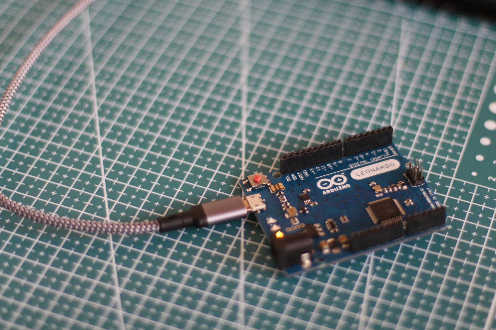
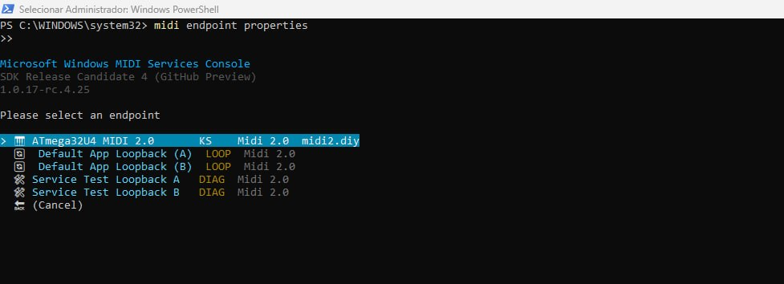
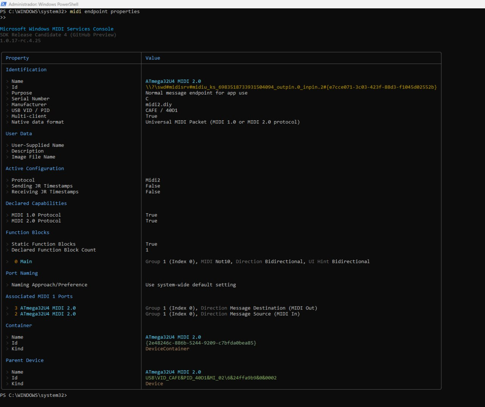
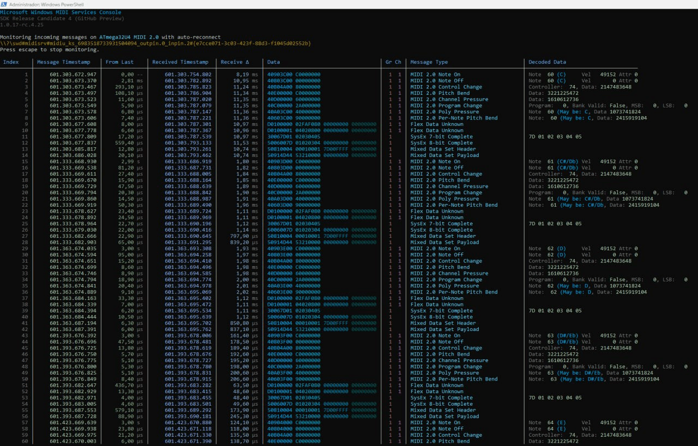

# [midi2](../..) | Device MIDI 2.0
## A complete USB MIDI 2.0 device on the ATmega32U4 (Arduino Leonardo / Pro Micro / Micro)

[](https://github.com/midi2-dev/MIDI2.0Workbench)



A full USB MIDI 2.0 device on the **ATmega32U4**, the Arduino-friendly sibling of
[atmega32u4-device-baremetal](../atmega32u4-device-baremetal/): same midi2 C99
core, same USB MIDI 2.0 class descriptors, but the USB transport is the
**[midi2duino](https://github.com/sauloverissimo/midi2duino)** library
(PluggableUSB, the stock Arduino core, no LUFA and no TinyUSB) instead of LUFA.
The midi2 core builds and parses the Universal MIDI Packets; midi2duino carries
them. It flashes with a normal Arduino upload, no manual reset ritual.

It enumerates as a MIDI 2.0 device (UMP), answers UMP Stream discovery and MIDI-CI
Discovery, cycles a readable showcase of the MIDI 2.0 message surface every three
seconds, and echoes back everything it receives. The whole device is 17 KB of
flash and 1.3 KB of SRAM on a 16 MHz 8-bit part.

## Always-UMP: what the Arduino core costs us

The stock Arduino AVR core (`USBCore.cpp`) accepts the USB `SET_INTERFACE`
request with an empty handler and never forwards it to PluggableUSB, so the
firmware cannot observe the host switching the MIDIStreaming interface from
alt 0 (MIDI 1.0) to alt 1 (MIDI 2.0). This device therefore **always speaks
UMP** on the bulk endpoints: the descriptors advertise both alternate settings
for correct enumeration, a MIDI 2.0 host selects alt 1 and receives UMP, and
that is the supported path. The LUFA baremetal recipe owns the USB stack and can
track the alt switch, so it additionally offers a MIDI 1.0 fallback on alt 0;
that fallback is not reachable here. Target a MIDI 2.0 host (Linux UMP, Windows
MIDI Services, macOS).

## USB identity

| Field | Value |
|---|---|
| VID:PID | `CAFE:40D1` (educational VID, development only) |
| Product | `ATmega32U4 MIDI 2.0` |
| Manufacturer | `midi2.diy` |
| UMP Endpoint Name | `ATmega32U4 MIDI 2.0` |
| FB 0 | `Main` (Bidirectional, 1 group, MIDI 1.0 + 2.0 protocols) |
| MIDI-CI | Discovery + NAK, capabilities `0x00` (nothing over-advertised), Manufacturer `{0x7D, 0x00, 0x00}`, Model `0x0002` |

PID `0x40D1` and Model `0x0002` distinguish this device from the LUFA baremetal
recipe (`0x40D0` / `0x0001`), so a host enumerating both side by side sees
distinct endpoints and separate caches. The USB descriptor VID/PID/strings come
from the Arduino build properties (see [Build](#build)); the UMP Endpoint Name
and the MIDI-CI identity live in the firmware and are reported regardless. Forks
into real products must replace both `idVendor` and `idProduct`.

## Layering

| Layer | Owns |
|---|---|
| Arduino AVR core (external, `arduino:avr`) | USB device core: enumeration, EP0, control transfers, bulk endpoint banks |
| [midi2duino](https://github.com/sauloverissimo/midi2duino) library (external) | the PluggableUSB node: raw USB-MIDI descriptors (alt 0 MIDI 1.0, alt 1 MIDI 2.0, Group Terminal Block via class GET_DESCRIPTOR), the two bulk endpoints, the UMP word pump (RX backpressure is a plain NAK) |
| midi2 C99 core ([`../../src`](../../src), vendored under `src/`) | typed dispatch, SysEx7 reassembly, MIDI-CI responder, UMP builders |
| `src/stream_responder.c` / `src/ci_responder.c` | device identity over UMP Stream and MIDI-CI |
| `src/midi2_usb.*` | the `Midi2Usb` veneer: wires the responders, pumps USB, exposes readable `send*` helpers. No `std::function`, no heap |
| `atmega32u4-device-arduino.ino` | the application: identity setup and the showcase loop |

## Build

Requires the **Arduino AVR Boards** core and the
**[midi2duino](https://github.com/sauloverissimo/midi2duino)** library (the midi2
core is vendored under `src/`):

```bash
arduino-cli core install arduino:avr
arduino-cli lib install midi2duino
```

Compile for the Leonardo (primary target), overriding the USB identity inline:

```bash
arduino-cli compile -b arduino:avr:leonardo \
  --build-property build.vid=0xCAFE \
  --build-property build.pid=0x40D1 \
  --build-property 'build.usb_product="ATmega32U4 MIDI 2.0"' \
  --build-property 'build.usb_manufacturer="midi2.diy"' \
  .
```

Upload (the CDC serial port stays enabled, so the 1200 bps touch triggers the
Caterina bootloader automatically, no manual reset):

```bash
arduino-cli upload -b arduino:avr:leonardo -p /dev/ttyACM0 .
```

**Arduino IDE users**: copy [boards.local.txt](boards.local.txt) next to the
core's `boards.txt` to apply the identity override, then open the `.ino`, pick
your board, and click Upload. Without the override the device still works and
still reports `ATmega32U4 MIDI 2.0` on the UMP wire; only the raw USB descriptor
VID/PID/strings fall back to the board's Arduino defaults.

**Other ATmega32U4 boards**: `-b arduino:avr:micro` (Arduino Micro) works the
same way. The SparkFun Pro Micro needs the SparkFun AVR board package
(`-b SparkFun:avr:promicro`); the sketch is identical, only the FQBN changes.

## Footprint

Measured with avr-gcc 7.3.0, `-Os -flto --gc-sections`, full firmware
(Arduino core USB + CDC + descriptors + pump + midi2 dispatch/proc/CI + app):

| Region | Used | Available |
|---|---|---|
| Flash | 17.1 KB (61%) | 28 KB (32 KB minus Caterina) |
| SRAM | 1.26 KB (49%) | 2.5 KB |

The CDC serial interface is kept on for the automatic-reset upload flow; that is
the main SRAM cost over the LUFA baremetal recipe, and it is what buys the
click-to-upload experience.

## Spec coverage

A readable, representative tour of the MIDI 2.0 surface. Everything below is
emitted by the showcase in `atmega32u4-device-arduino.ino`, group 0, and built
with the core's `midi2_msg_*` helpers.

| UMP message type | What the showcase sends | Spec |
|---|---|---|
| MT 0x4 Channel Voice 2.0 | Note On/Off (16-bit velocity), CC (32-bit), Program Change, Pitch Bend (32-bit), Channel Pressure, Poly Pressure, Per-Note Pitch Bend | M2-104-UM 7.4 |
| MT 0xD Flex Data | Set Tempo, Set Time Signature | M2-104-UM 7.5 |
| MT 0x3 Data64 | SysEx7 single packet | M2-104-UM 7.7 |
| MT 0x5 Data128 | SysEx8 single packet, Mixed Data Set (header + payload) | M2-104-UM 7.8/7.9 |
| MT 0xF UMP Stream | Endpoint Info, Device Identity, Endpoint Name, Product Instance Id, FB Info/Name, Stream Config (answered on request) | M2-104-UM 7.1 |

| MIDI-CI surface | Status |
|---|---|
| Discovery | answered with a per-boot randomized MUID (EEPROM boot counter + timer/frame jitter) |
| Unsupported categories | NAK; capabilities advertised as `0x00`, so nothing is over-promised |

Inbound: SysEx7 is reassembled by the core (`midi2_proc`) and delivered to the
MIDI-CI responder; any other UMP received is echoed straight back.

### What this recipe does NOT cover (and why)

- **MIDI 1.0 fallback (alt 0).** The stock Arduino core hides `SET_INTERFACE`,
  so the firmware cannot switch modes. Always-UMP only. Use the LUFA baremetal
  sibling for a device that is also musical on a MIDI 1.0-only host.
- **Property Exchange / Profiles.** Capabilities are `0x00` by design; this is
  a Discovery-and-play device, honest about advertising nothing it does not
  answer.

## Validation

- Linux (ALSA UMP): the kernel selects alt 1, reads the GTB and creates a
  native MIDI 2.0 endpoint. `/proc/asound/card*/midi0` shows `Num Blocks: 1`
  and the Function Block named `Main` (bidirectional), not a generic
  `Group 1-1`.
- UMP echo: notes sent to the device come straight back (`amidi -d`).
- MIDI-CI: Discovery Reply with a per-boot randomized MUID.
- Windows MIDI Services: enumerates as `ATmega32U4 MIDI 2.0`, Native data
  format UMP, one bidirectional Function Block.
- LED_BUILTIN toggles once per showcase cycle as a heartbeat.

Enumerated and monitored with the Windows MIDI Services Console:



The device appears as a native MIDI 2.0 endpoint alongside the standard loopbacks.



Native data format UMP, MIDI 1.0 + 2.0 protocols, one static bidirectional
Function Block (`Main`, Group 1).



The showcase on the wire: MIDI 2.0 Channel Voice, Flex Data, SysEx7, SysEx8 and
Mixed Data Set. The console's Decoded column does not yet render SysEx8 / MDS /
Flex payloads, so those rows read blank there; the raw UMP words in the Data
column are correct.

Pair with a MIDI 2.0 host recipe such as the RP2040/RP2350 hosts under
[midi2cpp/examples](https://github.com/sauloverissimo/midi2cpp), or plug it into
the same host you validate the
[atmega32u4-device-baremetal](../atmega32u4-device-baremetal/) sibling with.

## What lives where

```
atmega32u4-device-arduino/
  atmega32u4-device-arduino.ino   application: identity + showcase loop
  boards.local.txt                USB identity override for the Arduino core
  board/                          board photo + Windows MIDI Services captures
  src/
    midi2_usb.h / .cpp            Midi2Usb veneer (begin/task + send helpers)
    stream_responder.c / .h       UMP Stream identity responder
    ci_responder.c / .h           MIDI-CI Discovery responder
    board.h                       UMP Endpoint Name
    midi2_*.c / .h                midi2 C99 core (symlinked from ../../src)
```

The USB transport comes from the [midi2duino](https://github.com/sauloverissimo/midi2duino)
library, installed separately; the midi2 C99 core is vendored under `src/` via
symlink.

## License

MIT, same as the midi2 library. Builds on the Arduino AVR core (LGPL, linked as
the platform) with a standard Arduino sketch; no core sources are redistributed
here.
