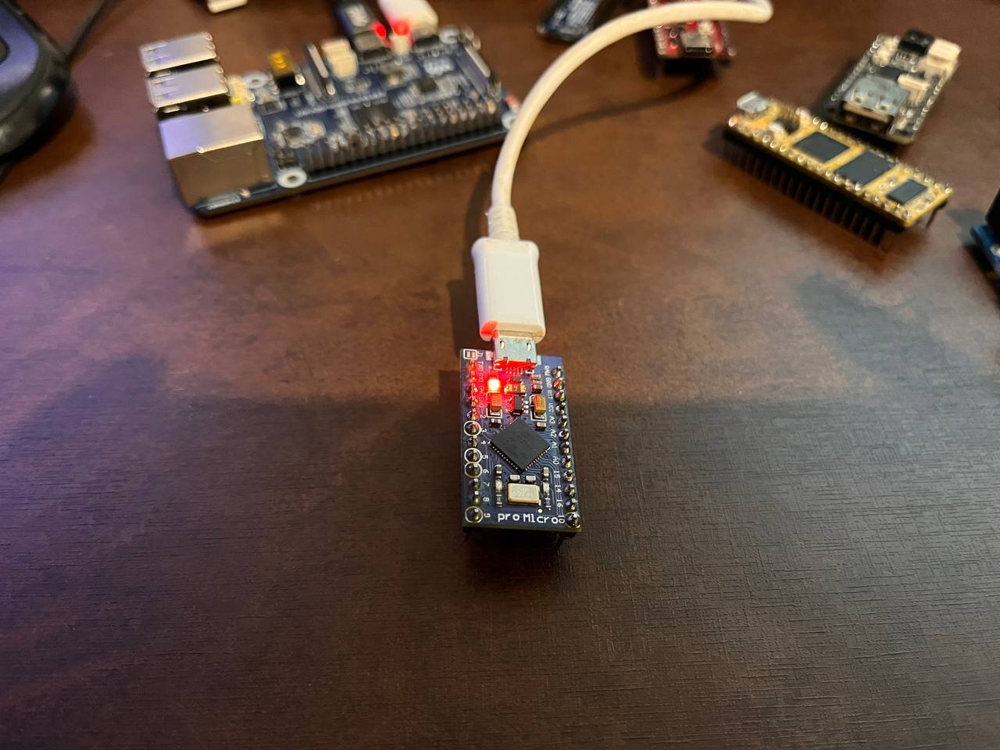

# [midi2](../..) | Device MIDI 2.0
## ATmega32U4 (Arduino Pro Micro), bare metal

[](https://github.com/midi2-dev/MIDI2.0Workbench)

USB MIDI 2.0 device on the **ATmega32U4**, the 8-bit AVR inside the Arduino
Pro Micro. Pure C99 over **LUFA**, no operating system: the whole device is
one super-loop at 16 MHz with 2.5 KB of SRAM.
It enumerates with both USB-MIDI alternate settings (alt 0 = MIDI 1.0,
alt 1 = MIDI 2.0/UMP), answers UMP Stream discovery and MIDI-CI Discovery,
and cycles a deterministic 58-entry UMP catalog covering every defined
message-type category of M2-104 (same catalog as the RP2350 FreeRTOS bench),
echoing back everything else it receives. In alt 0 it plays a 4-note riff,
so the device is still musical on MIDI 1.0-only hosts.



The USB MIDI 2.0 class layer over LUFA is
[midi2lufa](https://github.com/sauloverissimo/midi2lufa), the transport
library of this family: LUFA itself only provides the USB device core.
The Leonardo build of this firmware ships as midi2lufa's bundled example.

## USB identity

| Field | Value |
|---|---|
| VID:PID | `CAFE:40D0` (educational VID, development only) |
| Product | `midi2 Pro Micro` (`midi2 Leonardo` with `BOARD_SEL=leonardo`) |
| Manufacturer | `midi2.diy` |
| UMP Endpoint Name | same as Product |
| FB 0 | `Main` (Bidirectional, 1 group, MIDI 1.0 + 2.0 protocols) |
| MIDI-CI | Discovery + NAK, capabilities `0x00` (nothing over-advertised), Manufacturer `{0x7D, 0x00, 0x00}` |

PID `0x40D0` distinguishes this device from the other midi2 recipes; a host
enumerating several of them side by side sees distinct endpoints. Forks into
real products must replace both `idVendor` and `idProduct`.

## Layering

| Layer | Owns |
|---|---|
| LUFA (external, `LUFA_PATH`) | USB device core: enumeration, EP0, control transfers |
| midi2lufa (external, `MIDI2LUFA_PATH`) | transport: dual-alt descriptors, GTB, endpoint pump, word rings |
| midi2 C99 core ([`../../src`](../../src)) | typed dispatch, SysEx7 reassembly, MIDI-CI responder |
| `src/stream_responder.c` / `src/ci_responder.c` / `src/main.c` | device identity and the super-loop application |
| `src/catalog.c` | the 58-entry M2-104 catalog (host-unit-tested, shared design with `rp2350-device-freertos`) |

## Control surface (group 15)

Group 15 is not advertised (the FB spans group 0 only), so it works as a
sentinel control channel, identical to the RP2350 bench:

| Message on group 15 | Action |
|---|---|
| Note On, note N | emit catalog entry `N % 58` immediately |
| CC 120 | pause the 500 ms catalog cycle |
| CC 121 | resume |
| CC 119, value V | burst: V+1 full catalog sweeps back to back, paced only by the TX ring (the honest 16 MHz throughput test) |

## Build

Requires `avr-gcc`, `avrdude`, LUFA release **LUFA-210130** and midi2lufa:

```bash
git clone --branch LUFA-210130 --depth 1 https://github.com/abcminiuser/lufa
git clone https://github.com/sauloverissimo/midi2lufa
make all LUFA_PATH=/path/to/lufa/LUFA MIDI2LUFA_PATH=/path/to/midi2lufa
```

Flash through the stock Caterina bootloader, no ISP needed. Enter it with a
double tap on RST, then within the 8-second window:

```bash
avrdude -p m32u4 -c avr109 -P /dev/ttyACM0 -U flash:w:atmega32u4-midi2.hex
```

## Footprint

Measured with avr-gcc 7.3.0, `-Os -flto --gc-sections`, full firmware
(LUFA + midi2lufa + midi2 dispatch/proc/CI + app):

| Region | Used | Available |
|---|---|---|
| Flash | 16.7 KB | 28 KB (32 KB minus Caterina) |
| SRAM | ~1.1 KB | 2.5 KB |

## Validation

- Linux (ALSA UMP): the kernel selects alt 1, reads the GTB and creates a
  native MIDI 2.0 endpoint; the legacy port is named `Group 1 (Main)` from
  this recipe's Function Block Name reply.
- UMP echo: notes sent to the device come straight back (`amidi -d`).
- MIDI-CI: Discovery Reply with a per-boot randomized MUID.
- LED blinks on riff and echo activity (RX LED on the Pro Micro).

## Spec coverage

| Area | Status |
|---|---|
| USB-MIDI 2.0 alt settings (spec 5.x) | both alts, GTB via class GET_DESCRIPTOR |
| UMP Stream (M2-104): Endpoint Info, Device Identity, Endpoint Name, Product Instance Id, FB Info/Name, Stream Config | answered by `stream_responder.c` |
| MIDI-CI (M2-101): Discovery, Invalidate MUID, NAK for unsupported categories | answered by the midi2 core responder |
| MIDI 1.0 fallback | alt 0 with the same riff/echo, works on any host |

The catalog emits every defined message-type category on the wire: Utility,
System, MIDI 1.0 CV, SysEx7/Data64, MIDI 2.0 CV including per-note, SysEx8 +
Mixed Data Set, Flex Data and UMP Stream clips. SysEx7 is also reassembled
inbound by the core (`midi2_proc`) for MIDI-CI.

## License

MIT, inherits the parent [midi2 LICENSE](../../LICENSE). LUFA and midi2lufa are distributed separately under their own MIT-style licenses.

MIDI and MIDI 2.0 are trademarks of the MIDI Manufacturers Association / MIDI Association. This project is an independent implementation and is not affiliated with or endorsed by them.
