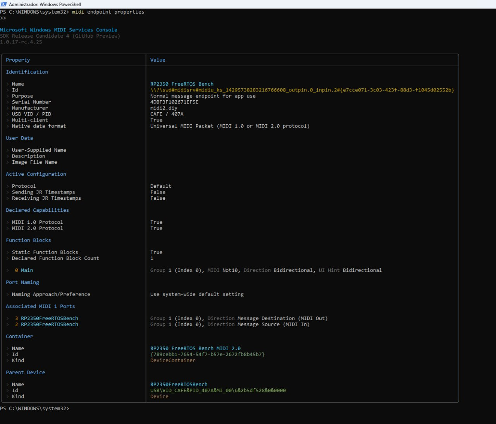

# [midi2](../..) | Device MIDI 2.0
## Raspberry Pi Pico 2 (RP2350), FreeRTOS

[](https://github.com/midi2-dev/MIDI2.0Workbench)

USB MIDI 2.0 device on the **Raspberry Pi Pico 2** (RP2350, Cortex-M33), pure
C99 over **FreeRTOS-Kernel + TinyUSB upstream** (the merged USB MIDI 2.0
device class, no fork). A deterministic catalog emitter cycles 58 UMP entries
covering every defined message-type category of M2-104-UM, alongside a MIDI-CI
responder. Two tasks, two static queues, zero heap.



## USB identity

| Field | Value |
|---|---|
| VID:PID | `CAFE:407A` (TinyUSB educational VID, development only) |
| Product | `RP2350 FreeRTOS Bench MIDI 2.0` |
| Manufacturer | `midi2.diy` |
| UMP Endpoint Name | `RP2350 FreeRTOS Bench` |
| FB 0 | `Main` (Bidirectional, 1 group, MIDI 1.0 + 2.0 protocols) |
| MIDI-CI Manufacturer ID | `{0x7D, 0x00, 0x00}` (non-commercial prefix) |

## Layering

| Layer | Owns |
|---|---|
| TinyUSB upstream | enumeration, MIDI 2.0 descriptors, built-in UMP Stream Discovery responder |
| `src/pipeline.c` (FreeRTOS) | `usb_task` is the sole owner of `tud_midi2_*`; `midi_task` runs the midi2 core; two static queues decouple them so multi-packet SysEx7 never interleaves |
| midi2 C99 core ([`../../src`](../../src)) | typed dispatch, UMP construction, SysEx7 reassembly, MIDI-CI responder |
| `src/catalog.c` / `src/ci_responder.c` | the 58-entry UMP catalog (host-unit-tested) and the device identity |

## Build

Requires Pico SDK 2.x, FreeRTOS-Kernel v11.2+ (with the
Community-Supported-Ports submodule) and TinyUSB upstream (the SDK-bundled
copy is MIDI 1.0 only).

```bash
PICO_SDK_PATH=/path/to/pico-sdk \
PICO_TINYUSB_PATH=/path/to/tinyusb \
FREERTOS_KERNEL_PATH=/path/to/FreeRTOS-Kernel \
cmake -B build -DPICO_BOARD=pico2
cmake --build build -j
```

Flash `build/rp2350-device-freertos.uf2` in BOOTSEL mode.

## Validation

```bash
lsusb | grep cafe:407a          # midi2.diy RP2350 FreeRTOS Bench MIDI 2.0
aseqdump -l | grep RP2350       # UMP endpoint, MIDI 2.0
```

Validated on hardware against the official
[MIDI 2.0 Workbench](https://github.com/midi2-dev/MIDI2.0Workbench): MIDI-CI
Discovery (Message Version 0x02), Profile Configuration and Property Exchange
complete, zero errors and zero warnings. On Windows the MIDI Services Console
lists it with Native data format = UMP and both protocols declared.

## Spec coverage

| UMP MT | Category | Spec |
|---|---|---|
| 0x0 | Utility (NOOP, JR Clock/Timestamp, DCTPQ, Delta Clockstamp) | M2-104-UM 7.2 |
| 0x1 | System Common / Real-Time (all 10) | 7.6 |
| 0x2 | MIDI 1.0 Channel Voice | 7.3 |
| 0x3 | SysEx7 (complete + fragmented) | 7.7 |
| 0x4 | MIDI 2.0 Channel Voice, per-note included | 7.4 |
| 0x5 | SysEx8 + Mixed Data Set | 7.8, 7.9 |
| 0xD | Flex Data (tempo, signatures, chord, text) | 7.5 |
| 0xF | UMP Stream (Device Identity, Start/End of Clip) | 7.1 |

MIDI-CI: Discovery, one Profile, Property Exchange (`DeviceInfo`,
`ChannelList`, `ProgramList`). Inbound control: NoteOn on group 15 fires a
single catalog entry; CC 120/121 pause and resume the cycle.

## License

MIT, inherits the parent midi2 library. TinyUSB and FreeRTOS-Kernel retain
their own licenses.
